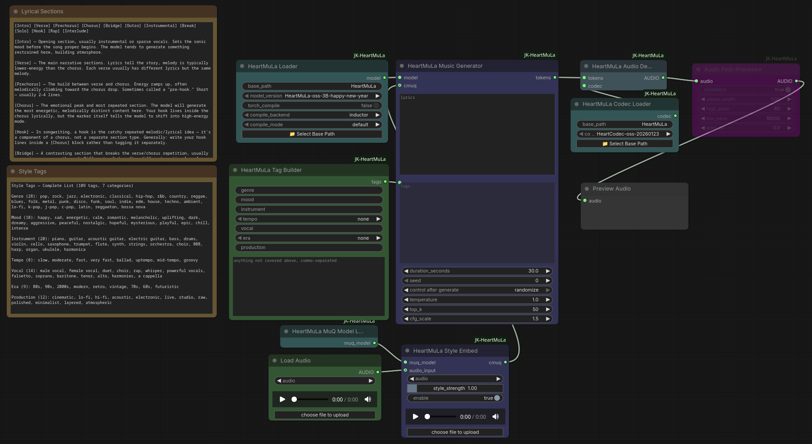

# ComfyUI-JK-HeartMuLa

**HeartMuLa music generation + lyrics transcription, with MuQ-MuLan reference-audio style transfer.**



A fork of [BobRandomNumber/ComfyUI-HeartMuLa](https://github.com/BobRandomNumber/ComfyUI-HeartMuLa) (Apache-2.0) that adds the ability to condition HeartMuLa music generation on the *style* of a reference track — its genre, mood, and instrumentation — via a MuQ-MuLan audio embedding. It bundles the full HeartMuLa toolset (loaders, generator, decoder, post-processor, lyrics transcription) so it works as a complete, standalone pack.

All node ids use the `JKHeartMuLa*` prefix and live under the **`JK-HeartMuLa`** category, so this pack installs **alongside** the original ComfyUI-HeartMuLa (or other HeartMuLa packs) without conflicts.

## What style transfer does (and doesn't) — read this

MuQ-MuLan turns the whole reference clip into a **single global genre/mood/instrumentation vector**. In practice that makes it behave more like **an alternative way to specify tags than a precise style clone or an enhancer on top of tags** — set expectations accordingly:

- ✅ It **nudges the overall genre / mood / instrumentation** toward the reference.
- ❌ It does **not** reliably transfer **tempo, loudness/energy, or spectral balance (brightness)** — those are emergent from generation and tend to drift (often quieter/darker), and no setting fully controls them.
- ❌ It does **not** clone voice, melody, or groove, and it is **not** a continuation engine — it won't seamlessly extend a clip.
- ⚠️ If the reference's genre already matches your text tags, it **adds little** — tags alone usually get you closest — and can even drift the sound *away* from the reference. In testing, a tag-only generation matched a techno reference's tempo/energy/brightness *better* than any style-transfer setting did.
- 👍 It helps most when the reference conveys a **vibe your tags can't easily put into words**. Treat it as a loose anchor used **alongside or instead of** tags, not a high-fidelity copy.

Best behavior: `style_strength` ~1.0 with `normalize` on. Over-driving (higher strength) destabilizes output (short, subdued).

## Installation

```bash
cd ComfyUI/custom_nodes
git clone https://github.com/Crono141/ComfyUI-JK-HeartMuLa.git
cd ComfyUI-JK-HeartMuLa
pip install -r requirements.txt
```

Restart ComfyUI; the nodes appear under the **JK-HeartMuLa** category. Requires a recent ComfyUI with the V3 node API (same as the original HeartMuLa pack).

## Model setup

HeartMuLa weights are **not** auto-downloaded (so models stay in one place and aren't duplicated across packs). Download them once with `git` + [Git LFS](https://git-lfs.com/) into `ComfyUI/models/HeartMuLa/`:

```bash
# from your ComfyUI root
cd models
git lfs install

# Base config files (gen_config.json + tokenizer.json) — this creates the HeartMuLa/ folder
git clone https://huggingface.co/HeartMuLa/HeartMuLaGen HeartMuLa
cd HeartMuLa

# Recommended model + codec (cloned as subfolders)
git clone https://huggingface.co/HeartMuLa/HeartMuLa-oss-3B-happy-new-year
git clone https://huggingface.co/HeartMuLa/HeartCodec-oss-20260123
```

Optional extras — clone these inside the same `HeartMuLa/` folder:

```bash
# Lyrics transcription (Whisper-based)
git clone https://huggingface.co/HeartMuLa/HeartTranscriptor-oss

# Alternate / older models
git clone https://huggingface.co/HeartMuLa/HeartMuLa-RL-oss-3B-20260123
git clone https://huggingface.co/HeartMuLa/HeartMuLa-oss-3B
git clone https://huggingface.co/HeartMuLa/HeartCodec-oss
```

Resulting layout:

```text
ComfyUI/models/HeartMuLa/
├── gen_config.json
├── tokenizer.json
├── HeartMuLa-oss-3B-happy-new-year/
├── HeartCodec-oss-20260123/
└── …optional extras
```

In the loader nodes, set **base_path** to `HeartMuLa` (the 📁 button browses folders) and pick the model/codec version from the dropdown — these correspond to the subfolder names above.

The MuQ-MuLan style model (`OpenMuQ/MuQ-MuLan-large`, ~2.5 GB) is the one exception: it **auto-downloads** from Hugging Face the first time the **HeartMuLa MuQ Model Loader** runs (it has no ComfyUI models folder), into your Hugging Face cache.

## Nodes

**Reused from HeartMuLa (rebranded `JKHeartMuLa*`):**
- **HeartMuLa Loader** — loads the generator LLM. `base_path`, `model_version`, optional `torch_compile` + backend/mode.
- **HeartMuLa Codec Loader** — loads the audio codec (fp32).
- **HeartMuLa Music Generator** — the core generator: lyrics, tags, duration, seed, temperature, top_k, cfg_scale, **plus an optional `cmuq` input** for style transfer. With `cmuq` unconnected it behaves exactly like the stock generator. Outputs tokens.
- **HeartMuLa Audio Decoder** — tokens → 48 kHz audio.
- **Audio Post-Processor** — normalize / stereo width / high-pass / low-pass / gain.
- **HeartMuLa Transcription Loader** / **HeartMuLa Lyrics Transcriber** — Whisper-based audio → lyrics.

**New in this fork:**
- **HeartMuLa Tag Builder** — per-category fields (genre / mood / instrument / vocal / production free-text with tag-suggestion tooltips; tempo / era dropdowns) plus a **multiline** `additional_tags` box. Lowercases, de-dupes, and comma-joins into a single `tags` string for the Music Generator. (Original implementation; concept inspired by RT-HeartMuLa.)
- **HeartMuLa MuQ Model Loader** — loads `OpenMuQ/MuQ-MuLan-large` for style embedding. Singleton; loads once per session. A **`device`** switch runs it on **cpu** (~2.5 GB RAM, no VRAM — default) or **gpu** (faster embedding, but holds ~2.5 GB VRAM resident — it isn't freed between runs and competes with generation). Style Embed runs on whichever device is selected.
- **HeartMuLa Style Embed** — produces the 512-D style embedding from a reference clip (24 kHz mono), with a per-clip progress bar.
  - **`enable` toggle** — flip style transfer on/off with a single switch. When off, it outputs a zero embedding (the Music Generator then runs tag-only, identical to `style_strength = 0`) and skips all audio + MuQ work — so one switch toggles a shared workflow between styled and tag-only without rewiring.
  - **Reference input** — drag an audio file onto the node / use the upload button (stored in ComfyUI's `input/`), **or** wire the optional **`audio_input` socket** from any AUDIO source (Load Audio, Record Audio, a trimmed clip, generated audio…). The socket wins when connected.
  - **`style_strength`** (0–2, type or drag) scales influence: `0` = off, `1.0` = natural/calibrated, `>1` over-drives (can destabilize — short/subdued output). Start at ~1.0.
  - **`normalize`** (default on) — re-normalizes the reference embedding to unit length before applying `style_strength`, so the strength means the same thing regardless of reference length (MuQ averages 10 s clips, so a longer reference otherwise yields a weaker vector).
  - **`free_vram_after`** (default on) — after embedding, offloads MuQ-MuLan back to CPU and frees its VRAM so the HeartMuLa models have room to generate. No effect when MuQ runs on CPU. The model stays cached in RAM (no reload) and is moved back to the chosen device automatically on the next embed. Pair with the loader's `device = gpu` for fast embedding without holding VRAM through generation.

## Example workflow


The recommended starting point is **`example_workflows/HeartMuLa Music Generator.json`** — the full default pipeline (Tag Builder → Music Generator with style transfer → Audio Decoder → Post-Processor → Preview, plus MuQ Loader / Style Embed / Load Audio), with all fields at defaults. Flip the Style Embed **enable** switch off for plain tag-only generation.

Also included: `style_transfer_basic.json` (minimal style-transfer graph), `HeartMuLaGeneration.json` (plain generation), and `HeartMuLaTranscription.json` (lyrics transcription).

## Notes

- **Reference audio that errors in Load Audio:** core Load Audio decodes with PyAV, which rejects some malformed MP3s (`avcodec_send_packet()` / "Invalid data"). The Style Embed node's own upload widget uses librosa (more tolerant) — drag the file straight onto Style Embed, or re-encode it to WAV/FLAC.

### torch_compile (HeartMuLa Loader)

`torch.compile` JIT-compiles the model into fused kernels to cut Python dispatch and GPU launch overhead — the **first** run is slower (it compiles), later runs are faster. It's optional and **off by default**: it needs a matching Triton/CUDA toolchain and is wrapped in `suppress_errors`, so it falls back to eager if compilation fails.

- **compile_backend** — `inductor` (default; generates fused Triton/C++ kernels; most reliable), `cudagraphs` (CUDA-graph capture; can log a harmless `unexpected keyword argument 'mode'` warning on some torch builds), or `eager` (no compilation, the baseline).
- **compile_mode** — `default` (compile + fuse, quick to build), `reduce-overhead` (adds CUDA graphs to cut per-step launch overhead; uses more memory), `max-autotune` (benchmarks kernel variants for top speed; **much** longer first compile).

> ⚠️ **CUDA-graph modes vs ComfyUI's allocator:** `reduce-overhead` and `max-autotune` enable **CUDA graphs**, whose memory-pool check isn't supported by the `cudaMallocAsync` allocator ComfyUI uses by default — you'll hit `RuntimeError: cudaMallocAsync does not yet support checkPoolLiveAllocations`. To use those modes, launch ComfyUI with **`--disable-cuda-malloc`**. Otherwise keep `compile_mode = default` (no CUDA graphs).

Reliable combo: `inductor` + `default`. Use `max-autotune` only together with `--disable-cuda-malloc`.

## Credits & license

This pack is Apache-2.0, as a derivative of:
- [BobRandomNumber/ComfyUI-HeartMuLa](https://github.com/BobRandomNumber/ComfyUI-HeartMuLa) — base nodes and bundled `heartlib`. See `NOTICE` for the list of modifications.
- [HeartMuLa/heartlib](https://github.com/HeartMuLa/heartlib) — the model library, and the [HeartMuLa](https://huggingface.co/HeartMuLa) team for the open weights.
- [OpenMuQ/MuQ](https://github.com/tencent-ailab/MuQ) — the MuQ-MuLan style-embedding model.

The Tag Builder's design was inspired by [monnky/ComfyUI-RT-HeartMuLa](https://github.com/monnky/ComfyUI-RT-HeartMuLa) (reimplemented from scratch; no code or data taken).

```bibtex
@misc{yang2026heartmulafamilyopensourced,
      title={HeartMuLa: A Family of Open Sourced Music Foundation Models},
      author={Dongchao Yang and Yuxin Xie and Yuguo Yin and others},
      year={2026},
      eprint={2601.10547},
      archivePrefix={arXiv},
      primaryClass={cs.SD},
      url={https://arxiv.org/abs/2601.10547},
}
```
